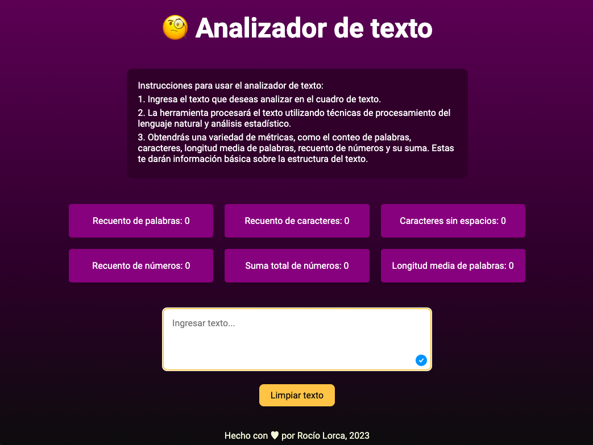

# Analizador de texto
## Resumen

El Analizador de Texto es una aplicación web que ofrece a los usuarios la capacidad de ingresar un texto en un cuadro de texto y obtener diversas métricas sobre el contenido. Utilizando técnicas de Procesamiento del Lenguaje Natural (NLP), el aprendizaje automático (ML) y análisis estadístico, la aplicación proporciona información útil y detallada sobre el texto introducido.

Funcionalidades:

 - Recuento de palabras: La aplicación cuenta el número de palabras en el texto de entrada y muestra este recuento al usuario. Esta función permite tener una visión rápida de la extensión del texto.

 - Recuento de caracteres: El analizador de texto también cuenta el número total de caracteres en el texto de entrada, incluyendo espacios y signos de puntuación. Esta métrica es útil para evaluar la concisión o extensión del contenido.

 - Recuento de caracteres excluyendo espacios y signos de puntuación: Además de contar los caracteres en general, la aplicación ofrece la opción de excluir los espacios y signos de puntuación del recuento. Esto permite identificar cuántos caracteres están realmente contribuyendo al contenido significativo.

 - Recuento de números: La herramienta puede contar la cantidad de números presentes en el texto. Esta función puede ser útil para analizar la presencia de datos numéricos o estadísticas en el texto.

 - Suma total de números: La aplicación no solo cuenta los números sino que también realiza la suma total de ellos, brindando un valor numérico que resume los datos cuantitativos en el texto.

 - Longitud media de las palabras: El analizador de texto calcula la longitud promedio de las palabras presentes en el texto de entrada. Esta métrica puede ofrecer una idea de la complejidad y estructura lingüística del contenido.

 - Limpieza del contenido: La aplicación proporciona una función para limpiar el cuadro de texto, permitiendo a los usuarios borrar el contenido y comenzar con un nuevo análisis.

## Estructura del código

Para realizar este proyecto se utilizó como referencia el boilerplate que entregó Laboratoria y contiene la siguiente estructura:

```text
./
├── .babelrc
├── .editorconfig
├── .eslintrc
├── .gitignore
├── README.md
├── package.json
├── src
│   ├── analyzer.js
│   ├── index.html
│   ├── index.js
│   └── style.css
└── test
    ├── .eslintrc
    └── analyzer.spec.js
```

## Descripción de scripts / archivos

* [`src/analyzer.js`](./src/analyzer.js): acá debes implementar el objeto
  `analyzer`, el cual ya está _exportado_ en el _boilerplate_. Este objeto
  (`analyzer`) debe contener seis métodos:
  - `analyzer.getWordCount(text)`: esta función debe retornar el recuento de
  palabras que se encuentran en el parámetro `text` de tipo `string`.
  - `analyzer.getCharacterCount(text)`: esta función debe retornar el recuento
  de caracteres que se encuentran en el parámetro `text` de tipo `string`.
  - `analyzer.getCharacterCountExcludingSpaces(text)`: esta función debe retornar
  el recuento de caracteres excluyendo espacios y signos de puntuación que se
  encuentran en el parámetro `text` de tipo `string`.
  - `analyzer.getNumberCount(text)`: esta función debe retornar cúantos números
  se encuentran en el parámetro `text` de tipo `string`.
  - `analyzer.getNumberSum(text)`: esta función debe retornar la suma de todos
  los números que se encuentran en el parámetro `text` de tipo `string`.
  - `analyzer.getAverageWordLength(text)`: esta función debe retornar la longitud
  media de palabras que se encuentran en el parámetro `text` de tipo `string`.
  En este caso usa 2 dígitos decimales.


## Diseño de producto

El diseño es minimalista y contiene una paleta de colores cálida. Muestra instrucciones para el uso del Analizador de Texto, luego contiene las métricas, la caja para introducir el texto y el botón para limpiar con color de mayor contraste para facilitar la experiencia de la usuaria.




<!--  -->